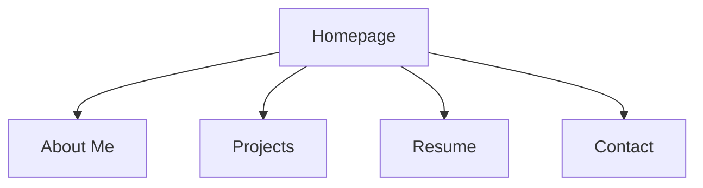
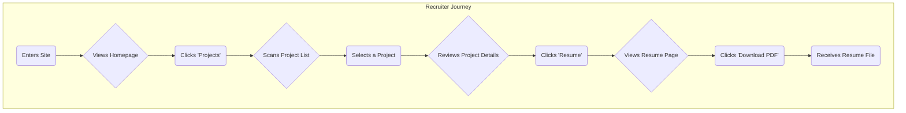

# resume-react-app UI/UX Specification

## Introduction

This document defines the user experience goals, information architecture, user flows, and visual design specifications for resume-react-app's user interface. It serves as the foundation for visual design and frontend development, ensuring a cohesive and user-centered experience.

## Information Architecture (IA)

### Site Map / Screen Inventory

### Navigation Structure

**Primary Navigation:** The primary navigation will be a persistent header bar containing links to: Home, About Me, Projects, Resume, and Contact. This provides users with consistent and immediate access to all major sections of the application from anywhere.

## User Flows & Scenarios

### Primary User Flow: Recruiter Review

This flow outlines the journey of a recruiter or hiring manager reviewing the portfolio to assess a candidate's qualifications.

## Wireframes

This section will contain low-fidelity wireframes for the key screens. These wireframes focus on structure and layout, not visual design.

*   **Homepage Wireframe:** (To be created)
*   **About Me Wireframe:** (To be created)
*   **Projects Wireframe:** (To be created)
*   **Resume Wireframe:** (To be created)
*   **Contact Wireframe:** (To be created)

